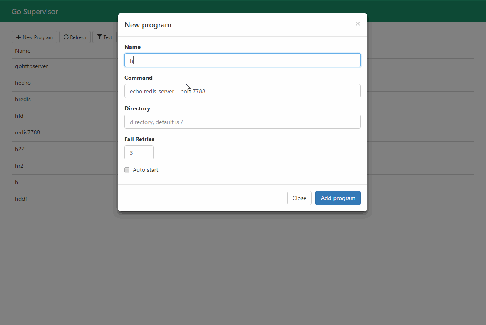

# 概述
 * gosuv是GO语言重写的类supervisor的一个进程管理程序，简单易用，界面美感十足且对用户友好。
 * 参考项目:
	 * https://github.com/codeskyblue/gosuv

## 使用
* 安装glide:
	* 如果已经安装直接跳过
	* 参考: https://github.com/Masterminds/glide
* 下载&运行Demo

```bash
# 下载编译代码
git clone https://github.com/wfxiang08/gosuv.git
cd gosuv/src
glide install
go build cmds/tool_gosuv.go

# 配置数据库
mysql -u root -p < conf/programs.sql

# 运行Demo:
./tool_gosuv -c conf/config.yml start
```
* 预览Demo: [http://localhost:11313/test/](http://localhost:11313/test/)

```bash
# 创建一个program: + New Program，输入如下信息:
名字: ping_test
命令： ping 127.0.0.1
工作目录: /
# 添加完毕之后就可以对program进行启动，关闭等操作，可以查看日志
```


## 详细了解配置文件
* conf/config.yml

```yml
server:
  ldap:
    enabled: true # 是否开启ldap认证
    host: xxxx
    base: ou=xxx,dc=test,dc=org
    port: 10489
    use_ssl: false
    bind_dn: uid=bind,ou=test,dc=org,dc=xx
    bind_password: xxx
    user_filter: (uid=%s)
    attributes:
    - givenName
    - sn
    - mail
    - uid
  addr: :11313
db:
  db_type: mysql
  db_dsn: root:@tcp(localhost:3306)/log?tls=skip-verify&autocommit=true
host: test # 可以通过 http://localhost:11313/test或http://localhost:11313/来访问，
admins:
- xiaogao
```

## 日志文件
* 日志的使用: `./tool_gosuv -c conf/config.yml start -L /data/logs/service.log`
* 实际的日志：
    * gosuv日志: /data/logs/service.log-20170617
    * 程序日志:  /data/logs/event_trigger.log-20170617

## 权限管理
* 每个Program都绑定一个Author, 只有Author和amdins可以对该Program进行管理和重启

## 服务的重启
* /usr/local/service/gosuv/tool_gosuv -c /usr/local/service/gosuv/config.yml restart

## 部署
* scripts/gosuv.service
	* 通过systemctl来管理gosuv
* scripts/scp_suv.sh
	* 将gosuv的配置文件，静态资源等部署到目标机器
* conf/nginx.conf
	* gosuv如何和nginx集成